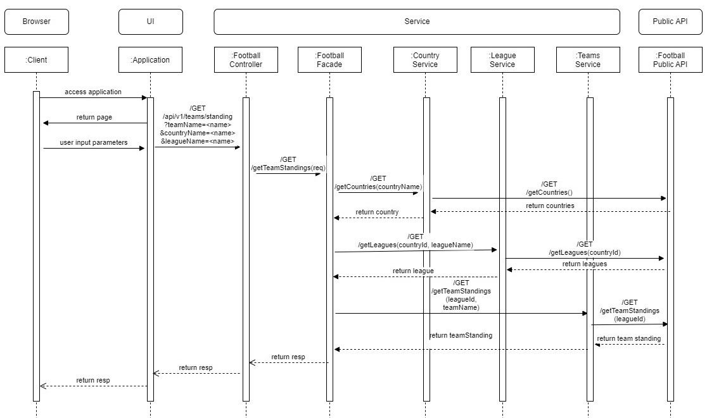

# Football Standing Micro service

## Problem:

Description:

Develop, Test and Deploy a Microservice to find standings of a team playing league football match using country name, league name and team name;
• End user should be able to view results by changing the input parameters
• The service should be ready to be released to production or live environment
• The service should be accessible via web browser or postman (using any one of JavaScript frameworks, HTML or JSON)
• The solution should support offline mode with toggles
• The service should return relevant results as expected, even while the underlying dependencies (Ex: Public API) are not available!

API Sources

API: https://apifootball.com/documentation/#Standings
Key: <API_KEY>
Documentation: https://apifootball.com/documentation/

Expected output

Country ID & Name: (<ID>) - <name>
League ID & Name: (<ID>) - <name>
Team ID & Name: (<ID>) - <name>
Overall League Position: <position>

## Solution:

Requirements

For building and running the application you need:

- [Spring Boot](http://projects.spring.io/spring-boot/) service.
- [JDK 11](https://adoptium.net/temurin/releases?version=11)
- [Maven 3.x](https://maven.apache.org)
- [Docker](https://www.docker.com/)
- [JENKINS](CI-CD)

## How to run application

There are several ways to run a Spring Boot application on your local machine. 

- Execute the `main` method in the `com.football.league.FootballApplication` class from your IDE.

- Run using spring-boot maven plugin
[Spring Boot Maven plugin](https://docs.spring.io/spring-boot/docs/current/reference/html/build-tool-plugins-maven-plugin.html) like so:

```shell
mvn spring-boot:run
```

- Run executable jar file

```shell
java -jar football-service.jar
```

- Build image and run as container

```shell
docker build -t football-service:1.0.0 --no-cache -f Dockerfile .
docker container run --name c_football-service -d -p 8080:8080 -t football-service:1.0.0
```

## CI-CD Pipeline implemented

Configure job for Jenkinsfile and run pipeline

## Sequence Diagram

```
 

```
## OPEN API Documentation

http://localhost:8080/api-docs/

SWAGGER UI:

http://localhost:8080/swagger-ui/index.html#/football/getTeamStandings

## API Test

Sample Request:

{
  "countryName": "England",
  "leagueName": "Non League Premier",
  "teamName": "Aveley"
}

## Design Patterns:

	Singleton Bean, Facade, Controller, RestTemplate..etc 

## SOLID, 12 factor principles followed 

## Design Tools used: draw.io

## NFR/Performance test using JMeter

```
 
 
 number of threads(users) - 10
 ram up time - 15
 
Label				# Samples	Average	Median	90% Line	95% Line	99% Line	Min		Max		Error 	% Throughput Received KB/sec	Sent KB/sec
football-sevice-api	10			1436	1384	1682		1682		1927		1135	1927	0.00%	0.67191		 0.24				0.13
TOTAL				10			1436	1384	1682		1682		1927		1135	1927	0.00%	0.67191		 0.24				0.13


 number of threads(users) - 10
 ram up time - 30
 
Label				# Samples	Average	Median	90% Line	95% Line	99% Line	Min		Max		Error %	Throughput	Received KB/sec	Sent KB/sec
football-sevice-api	10			1447	1258	1821		1821		2004		1025	2004	0.00%	0.34478		0.13			0.07
TOTAL				10			1447	1258	1821		1821		2004		1025	2004	0.00%	0.34478		0.13			0.07

```

## Copyright

Released under the Apache License 2.0. See the [LICENSE]
